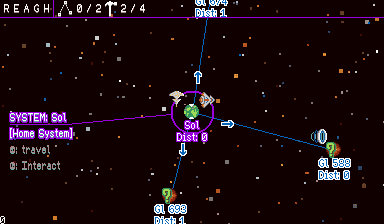

# Portfolio
Online projects by Stephan Steinbach. Thanks for coming by!

Engines mentioned:
* Quadplay (by @casualeffects): 
* Pico8: 

# Completed Games

*Click the thumbnail to play online!*

## Quadplay

### [Beat the Gobblins](https://stephan-gfx.itch.io/beat-the-gobblins)

|----------|
||
|2/15/2020|
|Started as a jam game w/ Ed Luong, features awesome music by Marlena Fecho.|
|[Source](https://github.com/morgan3d/quadplay/tree/master/games/beat_the_gobblins)|

### [Across The Lake](https://stephan-gfx.itch.io/across-the-lake)

|-----------------|
||
|[Post Mortem](https://docs.google.com/document/d/1Z8iBf_VUf_26AmKrWBJ9THso-UCqWl5NsIOpnSF9-1s/edit#)|[Post Mortem](https://stephan-gfx.itch.io/across-the-lake/devlog/141410/ludum-dare-46-post-mortem-across-the-lake)|
|4/20/2020|
|Ludum Dare game jam game for LD46, finished 27th overall and 12th in mood (out of 3576 submissions).  Theme was "Keep it Alive"| 
|[Source](https://github.com/morgan3d/quadplay/tree/master/games/across_the_lake)|

## Pico8

Pico8 projects done either in collaboration w/ Steve Lavieties or based on
co-developed basecode.

|Picotris Attack|Pentomino|Pushback|Dead Man's Slope|Pico De Pon|
|-----|----|----|----|----|
||||||
|12/21/2015|2/12/2017|5/7/2017|11/29/2017|04/07/2020|
|Based on Tetris Attack, first shipped project in pico8.|Done right before GDC in 2017|Attempt at a small game done quickly, wanted to try and do something that wasn't an adaptation.|Started while snowed in one winter and thinking back on ski free (although plays nothing like that game).|Steve and I returned to Tetris Attack after having worked on a megadrive version, as an homage to the awesome pico8 community.  Features music by tesselode and art from a variety of great games from the pico8 community that inspired us!|
|[Source](https://github.com/stevelavietes/pico8carts/blob/master/picotrisattack.p8)|[Source](https://github.com/stevelavietes/pico8carts/blob/master/pentomino.p8)|[Source](https://github.com/stevelavietes/pico8carts/blob/master/mazeburger.p8)|[Source](https://github.com/stevelavietes/pico8carts/blob/master/pushback.p8)|[Source](https://github.com/stevelavietes/pico8carts/blob/master/dead_mans_slope.p8)|[Source](https://github.com/stevelavietes/pico8carts/blob/master/picodepon.p8)|

# Demos/Utilties/Examples/Other

## Quadplay

|Acceleration Demo|Bounce Demo|Camera Shake|Transition/Sequence Demo|
|----|----|----|----|
|[Acceleration Demo](https://morgan3d.github.io/quadplay/console/quadplay.html?game=examples/accel_demo)|[Bounce Demo](https://morgan3d.github.io/quadplay/console/quadplay.html?game=examples/sproing)|[Camera Shake](https://morgan3d.github.io/quadplay/console/quadplay.html?game=examples/camera_shake)|[Transition/Sequence](https://morgan3d.github.io/quadplay/console/quadplay.html?game=examples/sequence_demo)|
| [Source](https://github.com/morgan3d/quadplay/tree/master/examples/accel_demo)|[Source](https://github.com/morgan3d/quadplay/tree/master/examples/sproing)|[Source](https://github.com/morgan3d/quadplay/tree/master/examples/camera_shake)|[Source](https://github.com/morgan3d/quadplay/tree/master/examples/sequence_demo)|

## Pico8

* Stdlib (basecode for our projects):
    * [Source](https://github.com/ssteinbach/pico8carts/blob/master/stdlib.p8)

|One Euro Filter|Performance Tests|Easing Function Gallery|
|-----|----|----|
||||
|07/14/2017|10/4/2017|09/18/2017|
|[Source](https://github.com/stevelavietes/pico8carts/blob/master/one_euro_filter.p8)|[Source](https://github.com/stevelavietes/pico8carts/blob/master/performance_test_gallery.p8)|[Source](https://github.com/stevelavietes/pico8carts/blob/master/easing_gallery.p8)|

## Tweet Carts

|Conway's Game Of Life Tweet cart|
|--------------------------------|
||
|5/19/2019|
|Done as an intro/invitation cart for an Alife interest group meet up|

# Unfinished Prototypes

|Space flight FX test|"Reach"|"Into the Pitch"|
|----|----|----|
| |||
|Pico8|Quadplay|Quadplay
| |4x-ish|Originally for 7drl|

|Planet Generator|Climbing Violets|Baseball Prototype|
|----|----|----|
|Screen shot of C++ version, click image to see on shadertoy:| ||
|C++/GLSL/ISPC|Pico8|Pico8|
|wanted to learn about procedural generation and raymarching.  planet generation algorithm is my interpretation of an algorithm from star control 2.  All of the generation was done offline in C++ and then ported to ISPC.  The rendering is entirely in a GLSL shader.|Had a cool level editor by @stevelavietes| |
