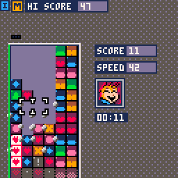
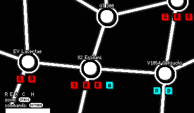
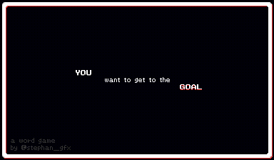
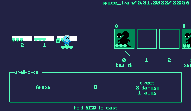
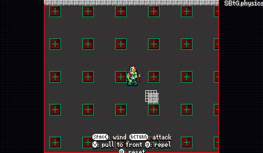
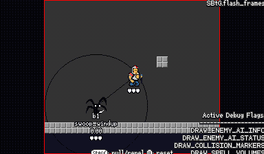

# Portfolio

Hi! Thanks for coming to visit, hope you're doing well!

*Most thumbnails are links to playable in the browser versions of the projects!*

# Table of Contents

- [Completed Games](#completed-games)
    - [Recent Projects](#recent-projects)
    - [Pico8](#pico8)
- [Smaller Projects](#smaller-projects)
    - [Libraries (Quadplay)](#libraries-quadplay)
    - [Pico8](#pico8-1)
        - [Basecode](#pico8-basecode)
        - [Library Demos](#library-demos)
        - [Tweet Carts](#tweet-carts)
- [Unfinished Prototypes](#unfinished-prototypes)
- [Engines Used](#engines-used)

# Completed Games

## Recent Projects

### 11/18/2022: PlayDaPon

||
|-----------------|
|*"The classic 16-bit action puzzle game brought to your playdate in vivid 1-bit color"*.  Completed with Steve Lavietes.  See the [Announcement Devlog](https://lonelystarsoftware.itch.io/playdapon/devlog/453491/introducing-playdapon) for a write up on how we took the codebase from a genesis/megadrive version of the game to playdate.  Update:  Now available on the Playdate store!|
|[Playdate Store](https://play.date/games/playdapon/)|
|[Announcement Devlog](https://lonelystarsoftware.itch.io/playdapon/devlog/453491/introducing-playdapon)|

### 8/3/2021: Ecto Scan

||
|-----------------|
|A game built for an episode of a TTRPG campaign I was GMming in the ghostbusters RPG system.  A retro-style four player game in which the players collaborate to find the source of a strange signal in 1985 san francisco. |
|[Post Mortem](https://docs.google.com/document/d/1mwWA4pgRnVl82A_EFPgTwX6ckVDy-Tyd_Dgy2pjZjU8/edit?usp=sharing)|

### 3/14/2021: [Rescue Roguelike](https://stephan-gfx.itch.io/rescue-roguelike)

||
|-----------------|
|A tactical roguelike 7DRL game executed in a week with [Ed Luong](https://github.com/mrawde), [Ian Patrick](https://www.instagram.com/ian.t.patrick/) and [Morgan McGuire](https://github.com/morgan3d).|
|[Post Mortem](https://docs.google.com/document/d/11patCRUp5gsgJVc7ZYi-QyltBxP0aE0BF6ax9syI99I)|
|[Jam Page](https://itch.io/jam/7drl-challenge-2021/rate/957256)|
|[Research Note: Enemy design in Into the Breach's first area](https://gist.github.com/ssteinbach/8780b0112a58a19f8154ae2061bb33fc)|

### 4/20/2020: [Across The Lake](https://stephan-gfx.itch.io/across-the-lake)

||
|-----------------|
|Ludum Dare game jam game for LD46, finished 27th overall and 12th in mood (out of 3576 submissions).  Theme was "Keep it Alive".|
|[Post Mortem](https://stephan-gfx.itch.io/across-the-lake/devlog/141410/ludum-dare-46-post-mortem-across-the-lake)|
|[Source](https://github.com/morgan3d/quadplay/tree/master/games/across_the_lake)|
|[Jam Page](https://ldjam.com/events/ludum-dare/46/across-the-lake)|

### 4/7/2020: [Pico De Pon](https://www.lexaloffle.com/bbs/?tid=37280)

| |
|---------|
|Steve and I returned to Tetris Attack after having worked on a megadrive version, as an homage to the awesome pico8 community.  Features music by tesselode and art from a variety of great games from the pico8 community that inspired us!  See the pico8 bbs page for the full list of thanks.|
|[Source](https://github.com/stevelavietes/pico8carts/blob/master/picodepon.p8)|

### 2/15/2020: [Beat the Gobblins](https://stephan-gfx.itch.io/beat-the-gobblins)

||
|-------------------------------|
|Started as a jam game w/ Ed Luong, features awesome music by Marlena Fecho.|
|[Post Mortem](https://docs.google.com/document/d/1Z8iBf_VUf_26AmKrWBJ9THso-UCqWl5NsIOpnSF9-1s)|
|[Source](https://github.com/morgan3d/quadplay/tree/master/games/beat_the_gobblins)|

### 11/29/2017: [Dead Man's Slope](https://www.lexaloffle.com/bbs/?pid=46604)

||
|--------|
|Started while snowed in one winter and ended up with a driving model inspired more by mario kart and some skiing physics.  Fun things: <ul><li>My first experiment with authored levels, which were described using a simple DSL in lua.</li><li>the player avatar is a mix of sprites (the body) and procedural graphics (the skis). Because the skis are rotating smoothly it makes the whole character feel better than the simple 8 frames or so of actual sprite there is.</li><li>It was also fun tuning the camera and particle effects to sell the speed and turns.</li><li>The course boundaries are drawn procedurally using splines</li></ul>|
|[Source](https://github.com/stevelavietes/pico8carts/blob/master/dead_mans_slope.p8)|

## Pico8

Pico8 projects done either in collaboration w/ Steve Lavieties or based on
co-developed basecode.

|Picotris Attack|Pentomino|Pushback|
|-----|----|----|
||||
|12/21/2015|2/12/2017|5/7/2017|
|Based on Tetris Attack, first shipped project in pico8.|Done right before GDC in 2017|Quick grid based game about sliding blocks.|
|[Source](https://github.com/stevelavietes/pico8carts/blob/master/picotrisattack.p8)|[Source](https://github.com/stevelavietes/pico8carts/blob/master/pentomino.p8)|[Source](https://github.com/stevelavietes/pico8carts/blob/master/pushback.p8)|

# Smaller Projects

Smaller projects - libraries, tests, tweet carts, all kinds of fun.

## Libraries (Quadplay)

These quadplay libraries help me get prototypes and jam games up and running quickly.

|[Acceleration Demo](https://morgan3d.github.io/quadplay/console/quadplay.html?game=examples/accel_demo)|[Bounce Demo](https://morgan3d.github.io/quadplay/console/quadplay.html?game=examples/sproing)|[Camera Shake](https://morgan3d.github.io/quadplay/console/quadplay.html?game=examples/camera_shake)|
|----|----|----|
||||
|While struggling with Beat the Gobblins, I stumbled across a GMTK video about [celeste's game feel](https://www.youtube.com/watch?v=yorTG9at90g&vl=en), and after seeing the graphs I  realized I could model those accelerations really simply using an ADSR model inspired by Steve Swink's [Game Feel](http://www.game-feel.com) book.  This test proved to be super useful, and I've cleaned it up into a very simple module I've since used on a number of projects.  Its driven off just three parameters: acceleration time from 0 to full speed (in frames), deceleration time from full speed to 0 under no acceleration (in frames) and maximum speed (in px/f).  You can see the table [here](https://github.com/morgan3d/quadplay/blob/2bc3f95cc5ce6960b6071d82b494b65428fb9ffd/examples/accel_demo/accel_lib.pyxl#L90) and further explanation [here](https://github.com/morgan3d/quadplay/blob/2bc3f95cc5ce6960b6071d82b494b65428fb9ffd/examples/accel_demo/accel_lib.pyxl#L1).|The bounce demo is based on @fourbitfriday's bounce demo from [a stream](https://www.twitch.tv/videos/576377070).  Again, it is built into an easy to integrate library and features a similar "profile" system as the acceleration library.|Every game needs camera shake!  This is a library for doing a simple nuclear throne/[vlambeer](https://www.youtube.com/watch?v=AJdEqssNZ-U) inspired 2d screen shake.|
| [Source](https://github.com/morgan3d/quadplay/tree/master/examples/accel_demo)|[Source](https://github.com/morgan3d/quadplay/tree/master/examples/sproing)|[Source](https://github.com/morgan3d/quadplay/tree/master/examples/camera_shake)|

|[Transition/Sequence](https://morgan3d.github.io/quadplay/console/quadplay.html?game=examples/sequence_demo)|
|-------|
||
|A simple turn transition library that also serves as a nice demo for using quadplay's `sequence` feature.|
|[Source](https://github.com/morgan3d/quadplay/tree/master/examples/sequence_demo)|

## Smaller Pico8 Projects/Libraries/Demos

Before shifting over to quadplay for personal projects, I really fell in love with pico8.

### Pico8 Basecode
The basecode for all the projects that Steve Lavietes and I collaborated on in pico8:

- [Source](https://github.com/ssteinbach/pico8carts/blob/master/stdlib.p8)

Designed to be stripped down at the end of a project to recover tokens.

Includes:

- Menu system
- Debug tools
- Object/Transform hierarchy (+coordinate systems)
- Morgan McGuire's Pico8 particle system library
- Camera system
- Mouse input

### Library Demos

|One Euro Filter|Performance Tests|Easing Function Gallery|
|-----|----|----|
||||
|07/14/2017|10/4/2017|09/18/2017|
|[Source](https://github.com/stevelavietes/pico8carts/blob/master/one_euro_filter.p8)|[Source](https://github.com/stevelavietes/pico8carts/blob/master/performance_test_gallery.p8)|[Source](https://github.com/stevelavietes/pico8carts/blob/master/easing_gallery.p8)|

### Tweet Carts

|Conway's Game Of Life Tweet cart|
|--------------------------------|
||
|5/19/2019|
|Done as an intro/invitation cart for an Alife interest group meet up|

# Unfinished Prototypes

Hodgepodge of unfinished prototypes from projects over the years.

|Space flight FX test|"Reach"|"Into the Pitch"|
|----|----|----|
| | ||
|Pico8|Quadplay|Quadplay
| |4x-ish|Originally for 7drl|

|Planet Generator|Climbing Violets|Baseball Prototype|
|----|----|----|
|Screen shot of C++ version, click image to see on shadertoy:| ||
|C++/GLSL/ISPC|Pico8|Pico8|
|wanted to learn about procedural generation and raymarching.  planet generation algorithm is my interpretation of an algorithm from star control 2.  All of the generation was done offline in C++ and then ported to ISPC.  The rendering is entirely in a GLSL shader.|Had a cool level editor by @stevelavietes| |

|[Word Game](https://morgan3d.github.io/quadplay/console/quadplay.html?game=examples/word_game)|[A Dark Drive](https://stephan-gfx.itch.io/a-dark-drive)|
|-------|-----|
|||
|Quadplay|Quadplay|
|This was a test for making a game entirely out of words, looking at how easy it would be for me to add content to a game with such minimal aesthetics.  Links: [Post Mortem](https://docs.google.com/document/d/1pkV4FL_167ArQkXBkH9Njl_4P4Eq3-UYK7MJegNddvA/edit?usp=sharing), [Source](https://github.com/morgan3d/quadplay/tree/master/examples/word_game), [Play Online](https://morgan3d.github.io/quadplay/console/quadplay.html?game=examples/word_game)|GMTK2020 Jam game, completed with Ed Luong and Nick Porcino.  Really a mood and feel test.  I did the intro, menus and audio.  [Post Mortem](https://docs.google.com/document/d/1dtOKkXylYiF1GGeCd8CCK5vLSxul7kusU9kGm41_bHc/edit?usp=sharing), [Source](https://github.com/morgan3d/quadplay/tree/master/examples/a_dark_drive), [Play Online](https://stephan-gfx.itch.io/a-dark-drive) |

|Playdate Prototype|Gravity Prototype|
|-----------|-------------|
|| |
|Quadplay|Quadplay|
|A prototype for a playdate game, where you used the crank to do gestures to cast spells, trying to defend the cars of a train from enemies approaching from the right.|Prototype built around some pieces from Beat the Wizzard for an action game with a gravity throwing mechanic.|
|2022|2021,2022|

# Engines Used

- Quadplay (by @casualeffects): 
- Pico8: 
